# In code documentation.

    - There is 6 major directories account, body, contexts, switches, users, custom-hooks.

1. `Account` contains components for Login, Register and Logout + tokenValidations and local storage services.
2. `Body` contains all other components that we render and the folders you can find there are createQuiz, dashboard, dummyComponents - our containers, historyPage, leaderboardPage, navBar, quizViewForTeacher, quizzesInCategory and solveQuiz.
3. `Contexts` contains both contexts that we use and there are for authorization and categories.
4. `Switches` contains separations depending of authorization and authentication inside you can find LoggedSwitch which is available for users that already have logged in and NotLoggedSwitch for that who is not. Switches for both type of users Teacher and Student with proper restricted rouths for both of them.
5. `Users` contains Teacher and Student dashboards
6. `Custom-hooks` contains useAuthorizedFetch which is our custom-hook for fetching data and we use it instead of regular fetch.

# On the website documentation.

    - There is 3 major parts Public, Teacher and Student

1. Public part.
   1. Sign-in window gives you an option for login in to the website. 
      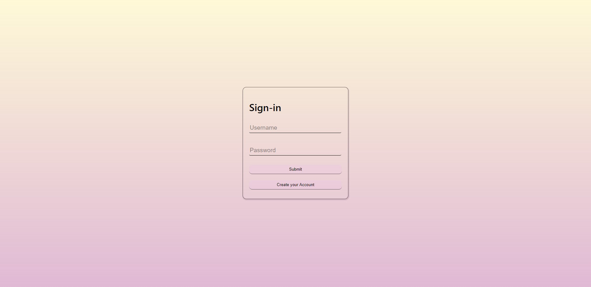
   2. Register window gives you an option to create account as a student. 
      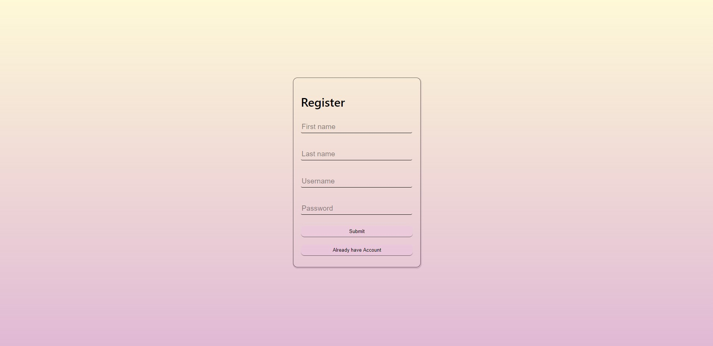
2. Teachers part.
    - When you loged in as a teacher you see teacherrs dashboard. 
    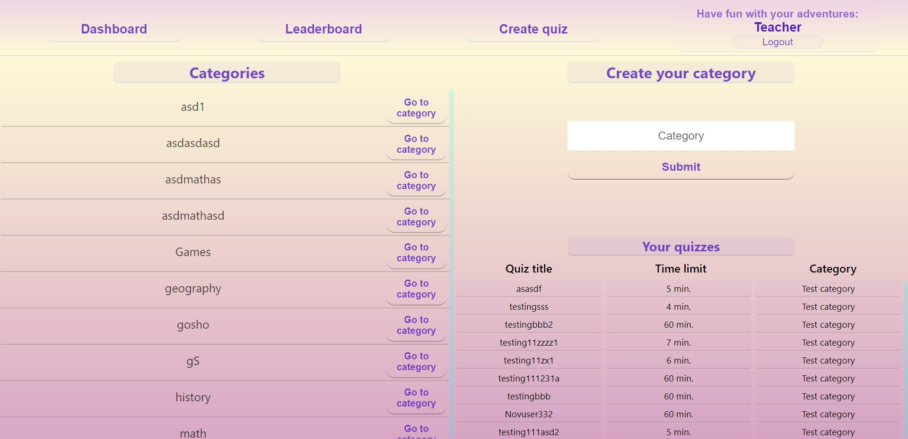 
    It contains:
        - Categories section with all available categories in every single one of them there is a button `Go to category` which leaads to category page that contains:
            - information for every quiz whichh is in that category and option to solve it or check who already solved it with a `SOLVE` and `View` buttons 
            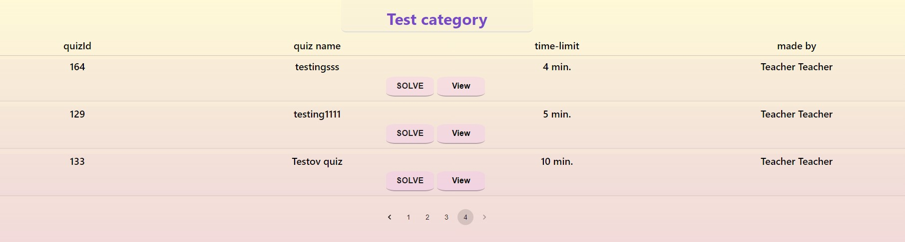 
                - `Solve` press gives you an information that you can solve a quiz onece 
                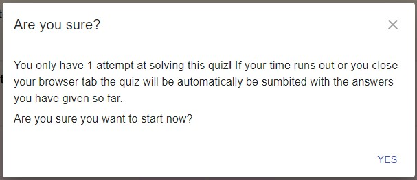 
                After pressing yes you are redirected to solve quiz page which gives you an option to solve the chosen quiz 
                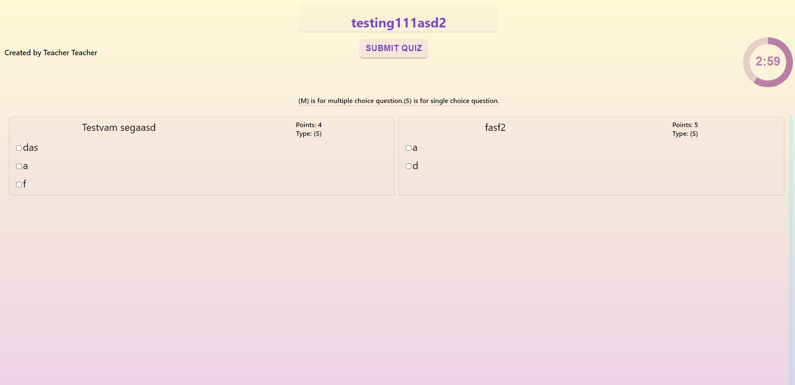 
                - There is 3 ways to finish the quiz 
                    1. Pressing the `SUBMIT QUIZ` button
                    2. Time limit finishes
                    3. Reloading the page
                - When you submit the quiz you got a messaage with your score and  `Go back to dashboard button`  
                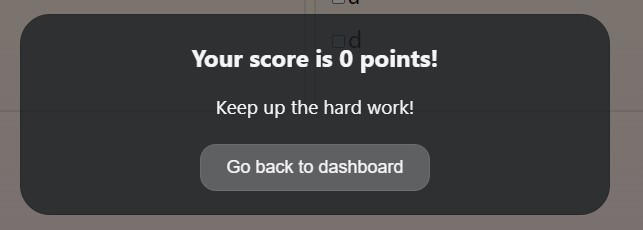  
        - Create your category form that gives the user an option to create his own category
        - Your quizzes that shows every single quiz that user are created
        - Navigation Bar
            - `Dashboard` button that leads to users dashboard
            - `Leaderboard` button that leads to full students leaderboard 
            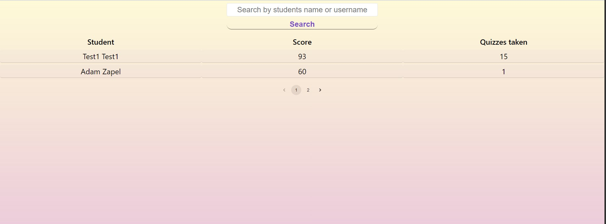 
            - `Create quiz` button that leads to create quiz page 
                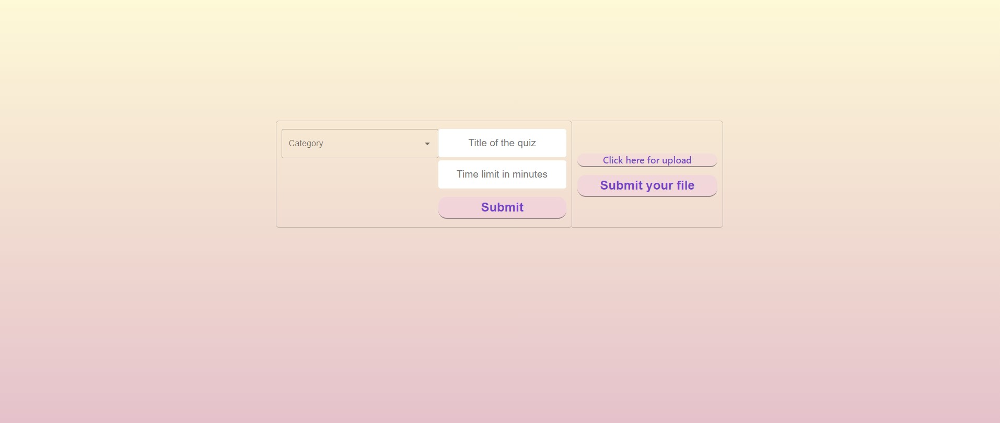 
             which contains:
              - Import quiz by JSON format file
              - Create quiz form. After proper data input there is a `Submit` button that leads to create questions form 
                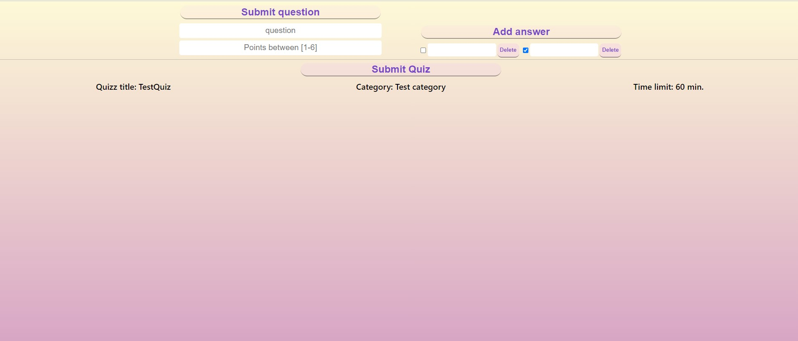 
                After proper data input there is a `Submit Quiz` button that gives you an option to export created quiz in JSON format file by pressing `Export Quiz` button or go back with pressing `Go back to create quiz form` button 
                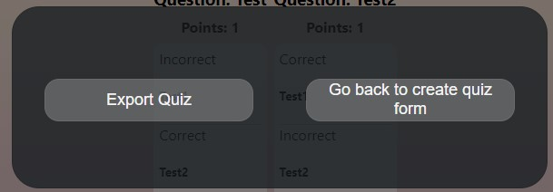 
            - Greating message and `Logout` button
3. Students part    
    - When you loged in as a student you see students dashboard. 
    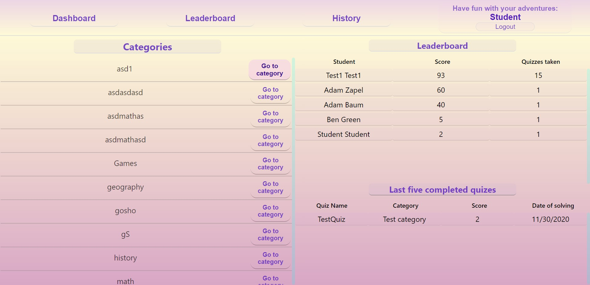 
    It contains:
         - Categories section its the same as in teacher
         - Leaderboard which shows the students with top 5 scores
         - Last five completed quizzes which contains the last 5 quizzes compleated by the studeent
         - Navigation Bar only differense is the `History` button that shows all qquizzes complited by the student 
        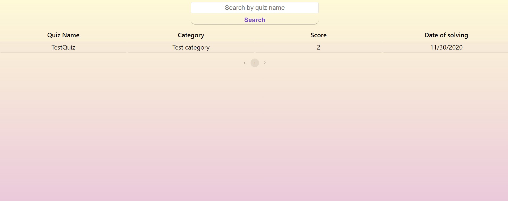 
